  <h1>Olá, sou Luis Gustavo</h1>
  
<strong>Desenvolvedor Backend Java | APIs Restful | Database</strong>

 

  
  
  
  
  
  
  

   

  
  
  

   

  
  
  

   

  
  
  
  

   

  
  
  

   

  
  
  
  

 

<!-- gráfico de contribuições animado: dados reais, células reveladas uma a
     uma (regenerado por scripts/fetch_contributions.py + render_heatmap.py) -->
<h3><code>gustavo@github ~ $ ./contributions.sh</code></h3>

 
 

<!-- terminal simulado com foco, stack e destaques -->
<h3><code>gustavo@github ~ $ neofetch</code></h3>

 

<h2>Sobre mim</h2>

Sou um desenvolvedor em constante evolução, fascinado por como os sistemas se comunicam por baixo do capô. Em vez de focar apenas em teoria, prefiro construir projetos que resolvam problemas reais usando <strong>Java</strong> e outras tecnologias.

<ul>
  <li><strong>No que eu coloco a mão:</strong> Muito <strong>Java</strong> com <strong>Spring</strong> e um pouco de <strong>Kotlin</strong>. Gosto de entender como a regra de negócio vira código de verdade.</li>
  <li><strong>Engenharia de Dados:</strong> estrutura com database <strong>MySQL</strong> e conhecimento em outros database.</li>
  <li><strong>Gestão de Projetos:</strong> Domínio de <strong>Maven</strong> e <strong>Gradle</strong> para automação de builds e documentação com <strong>SpringDoc</strong> (Swagger).</li>
  <li><strong>Mobile:</strong> apps <strong>Android</strong> em <strong>Kotlin</strong>, com <strong>Retrofit</strong> e <strong>OkHttp</strong> (interceptor de autenticação JWT) para consumo de API, <strong>Gson</strong> para JSON e <strong>Coroutines</strong> para requisições assíncronas.</li>
  <li><strong>Fluxo Dev:</strong> conhecimento de Git/GitHub, Postman, Ngrok para túneis.</li>
</ul>

<blockquote>
  <strong>Meu foco atual:</strong> Transformar ideias em APIs seguras e funcionais. Se o código está testado, eu durmo tranquilo. ☕
</blockquote>

<blockquote>
  <strong>Caminho futuro:</strong> busco aprender mais com novas tecnologias e metodologias de desenvolvimento.
</blockquote>

 

<h2>Tecnologias & Ferramentas</h2>

  <h3>Linguagens e Frameworks</h3>
  

   

  <h3>Infra, Dados e Ferramentas</h3>
  

  

<h3 align="center">🌐 Conecte-se comigo</h3>

  
  
  
  

